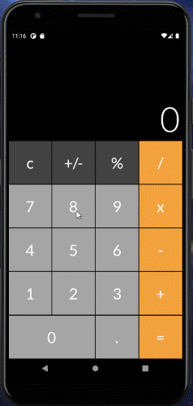

# flutter-labs
Cross-platform Applications Development course (Flutter) homework exercises

## Lab6 - Text widget "Hello Flutter"

## Midterm - iOS calculator clone

## Lab10 - bus management system

